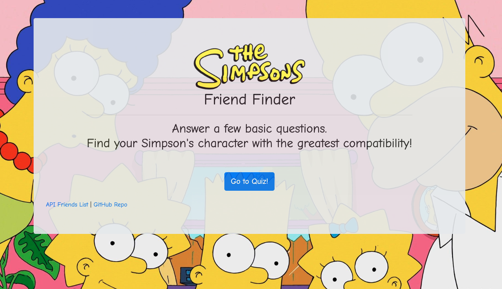

# The Simpson's Friend Finder
Full-stack web application using Express to handle routing of client-side requests.

## Overview: 
The Simpson's Friend Finder is a fun quiz that takes in the user's information provided and compares their answers with those from other users (Simpson characters).  The app will then match and display the name and gif of the character with the best 'friend compatibility'.

## Author:
Lindsey Tummond
- <a href="https://lindseytummond.github.io/portfolio/" target="_blank"> Portfolio </a>
- <a href="https://github.com/lindseytummond" target="_blank"> GitHub </a>
- <a href="https://www.linkedin.com/in/lindsey-tummond-b86aa341/" target="_blank"> LinkedIn </a>

## Future Enhancements:
Future developments would include creating additional matching characters and displaying the User's Name and Photo to the matched Simpson character within the modal.

## Learning Points:
- File management for different sections of a project for clear organization for fellow developers future use.
- Using `module.exports` to communicate between multiple Javascript files.
- Defining routes with Express with `app.get` and `app.post`
- Response methods `res.json` and `res.sendFile` to send a response to the client and terminate the request-response cycle.

## Technologies:
-   HTML
-   CSS
-	Javascript
-	Node.js
-	NPM package
    -	Express
    -   Path
-   GitHub
-   Heroku

## How to Use:
Use the following link https://friend-finder-tummond.herokuapp.com/ to open the application and select the 'Go to Quiz' button.  
Complete the quiz questions to prompt the modal to populate with the Simpson's character you have the most compatability.

## App Example:
<!-- 
 -->

  

